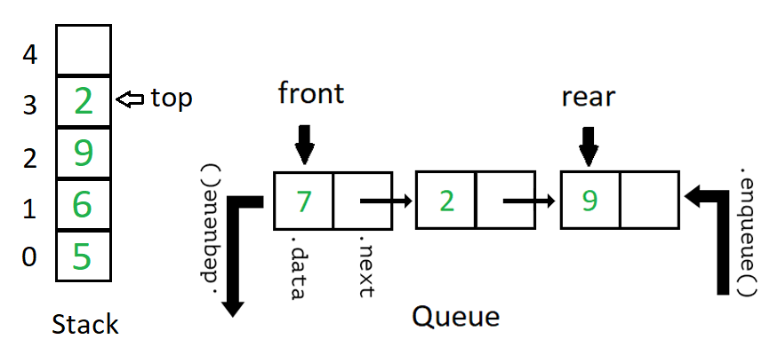
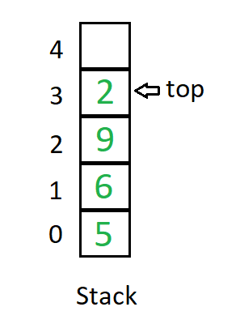
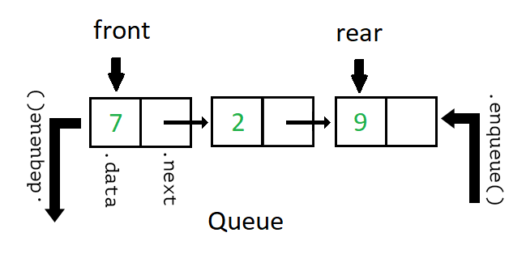

# Stacks and Queues



---

# Stacks

Imagine a stack like a stack of cafeteria trays. You're only allowed to do two things:

* **.push(value)** add a new value to the top of the stack
* **.pop()** remove whatever is on the top


---

## Stack Implementation

* Implement a Stack using an array.
* You only ever add or remove things at the end of the array.
* You never access elements in the middle so you never perform `O(N)` rearrangements
* `.push(value)` and `.pop()` are guaranteed to always be `O(1)`



---

## Stack Implementation

```js
class Stack
  constructor() {
    // start with 7 spots. we can add a ._grow() method later
    this.data = new Array(7)
    this.top = 0
  }

  push(value) {
    this.data[this.top] = value
    this.top++
  }

  pop() {
    this.top--
    let result = this.data[this.top]
    this.data[this.top] = null
    return result
  }

  isEmpty() {
    return this.top === 0
  }
}
```

---

## Common Stack Algorithms

Although stacks have a very limited number of operators with just the `.push()` and
`.pop()` methods they are still very useful in interesting problems. And restricting
ourselves to these operations gains us `O(1)` efficiency too!

* Maintaining undo/redo history pushing and popping every user action.
* Implementing a Call Stack, keeping track of what functions are executing in a program
  pushing each new function call on the Call Stack and popping it off when it's done.
* Building a parenthesis/curly brace/bracket balanced syntax checker.
  * `.push()` every opening paren on and `pop()` things off when you see a closing one

---

## Algorithm: isBalanced
Write a function called `isBalanced` that accepts a string. The string represents code.
Your function should return `true` or `false` depending on if the parenthesis in the
code are balanced.

* `isBalanced('')` returns `true`
* `isBalanced('()')` returns `true`
* `isBalanced('foo()')` returns `true`
* `isBalanced('()()')` returns `true`
* `isBalanced('(()())')` returns `true`
* `isBalanced('((()))')` returns `true`
* `isBalanced('(() => { foo(); bar() })()')` returns `true`


* `isBalanced('(')` returns `false`
* `isBalanced(')')` returns `false`
* `isBalanced(')(')` returns `false`
* `isBalanced('() => { foo(); bar() })()')` returns `false`

---

## Algorithm: isBalanced
Here's an explanation of how to build out the `isBalanced` algorithm using a
`Stack`.

* Create a new stack
* Iterate through each character of the string
  * if the character is an opening paren
    * push it on the stack
  * if the character is a closing paren
    * Try to pop a matching open paren off the stack
    * if you see a closing paren and the stack is empty
        * return false
  * Ignore any character that is not an opening or closing paren
* If the stack is empty after iterating through all characters return `true`
* If the stack is not empty this means some open parens were left unmatched.

Now try to code this out!

---

## Queue

* A `Queue` is a data structure similar to people standing in a line.
* Items can be `enqueueed()` added to the back of the line
* Items can be `dequeueed()` removed from the front of the line
* You may not access any elements in the middle of the line.
* Queues are built out of linked lists keeping reference to the front and back
  of the line.
* `.enqueue()` and `.dequeue()` are both `O(1)` operations.



---

## Queue Implementation

```js
class QueueNode {
  constructor(data) { this.data = data; this.next = null }
}

class Queue {
  constructor() { this.front = null; this.end = null }
  isEmpty() { return this.front === null }

  enqueue(data) {
    let node = new QueueNode(data)
    if (this.front === null) {
      this.front = node
    } else {
      this.end.next = node
    }
    this.end = node
  }

  dequeue(data) {
    let data = this.front.data
    this.front = this.front.next
    return data
  }
}
```

---
## Tracking Size
It's useful to keep track of the number of things inside these data structures.

Pretty much for any data structure it's possible to add a `.size` attribute to
the class and increment it and decrement it whenever things are added or removed

Maintaining this count as items are added and removed is better than taking `O(N)`
to traverse through any data structure and count items one by one.

```js
  constructor() {
    this.size = 0
    // ...
  }

  enqueue(data) {
    this.size++
    // ...
  }

  dequeue(data) {
    this.size--
    // ...
  }
```

---

## Common Queue Algorithms
Queues are an extremely efficient data structure for maintaining order of things.
Constraining ourselves to manipulating just the front or end of the list guarantees
that our `.enqueue()` and `.dequeue()` operations are always `O(1)`, so adding
or removing something will take the same constant amount of time no matter if there
are one hundred or one billion elements in the queue.

* Keep track of songs in a playlist
* Add things to a list of things that should be processed in a certain order.
* Breadth-first traversals

---

### Algorithm: Eeney-meeney-miney-mo

Wikipedia: [The Josephus Problem](https://en.wikipedia.org/wiki/Josephus_problem)

Build a function called `eeney` that simulates the children's game
Eeney-meeney-miney-mo. The function should accept two parameters: an array
`items` and an integer `N`.

Count through the items one at a time and eliminate every `Nth` item until
there is just one item left. Return the value of that item.

```js
items = ['ace', 'bar', 'car', 'far']
eeney(items, 7)
```

* 1 ace 2 bar 3 car 4 far 5 ace 6 bar 7 car
* car is eliminated leaving [ace, bar, far]
* 1 far 2 ace 3 bar 4 far 5 ace 6 bar 7 far
* far is eliminated leaving [ace, bar]
* 1 ace 2 bar 3 ace 4 bar 5 ace 6 bar 7 ace
* ace is eliminated leaving only [bar]
* return `bar`

---

### Algorithm: Eeney-meeney-miney-mo

* Create a new `Queue`
* `.enqueue()` every item from the list
* Run a while loop that runs until there is just one thing left in the queue
* Count up to `N`
  * for each count `.dequeue` and `.enqueue` the first item in line
  * When you reach `N` dequeue the item at the front of the line and do not
    `.enqueue()` it again.
* Return the single item left in the queue
